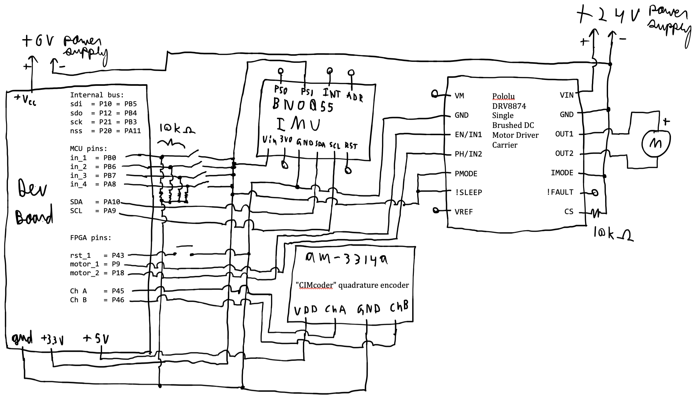

# Schematics

The above constitutes the full schematic for our project. It is based on the E155 FA22 Development Board, schematics for which can be found [here](https://pages.hmc.edu/brake/class/e155/fa22/assets/doc/E155%20FA22%20Development%20Board%20Schematic.pdf).

# Source Code Overview
Our source code consists of two codebases: one for the MCU and one for the FPGA. Both can be found in their full form, with everything needed to run the code, in [this](https://github.com/GabrielKS/microps-cat) repository of ours. An excerpt consisting of the most important code we wrote can be found [here](./src).

# Bill of Materials

| Item | Part Number | Quantity | Unit Price | Link |
| ---- | ----------- | ----- | ---- | ---- |
| Xin Da Brushed Motor | 3420 | 1 | $23.09* | [motor](https://www.amazon.com/Electric-Motor-Acogedor-Permanent-Magnet/dp/B07GT1CRHP/ref=asc_df_B07GT1CRHP/?tag=hyprod-20&linkCode=df0&hvadid=563721192637&hvpos=&hvnetw=g&hvrand=9506774832461316846&hvpone=&hvptwo=&hvqmt=&hvdev=c&hvdvcmdl=&hvlocint=&hvlocphy=9031250&hvtargid=pla-850857892696&psc=1)|
| Adafruit Inertial Measurement Unit (IMU) | 2472 | 1 |$34.95 | [IMU](https://www.andymark.com/products/cimcoder-encoder-cim-motor-high-resolution) |
| AndyMark High Resolution CIM Encoder | am-3314a | 1 | $29.00 | [Encoder](https://www.adafruit.com/product/3317) |
| Pololu DRV8874 Single Brushed DC Motor Driver Carrier |  4035 | 1 | $9.15 | [Driver](https://www.pololu.com/product/4035)|
| HOZEON 6061 Aluminum Sheet | KEILEOHO | 1 | $37.99 |  [Aluminum](https://www.adafruit.com/product/3317) |
| MCICICM Breadboard|  400tie | 1 | $6.69 |  [BreadBoard](https://www.adafruit.com/product/3317) |

*not included in total cost

**Total cost: $117.78**
