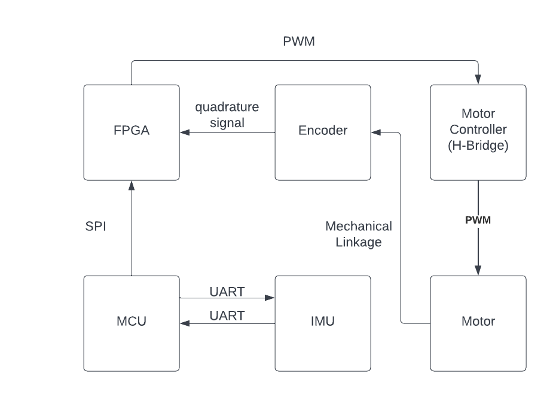

  

# Project Abstract
Cats have a reputation for always landing on their feet. Many other animals exhibit similar behavior; in general, it has been [shown](https://ieeexplore.ieee.org/abstract/document/7562541) that animals' use of body parts such as tails to reorient themselves in free fall is similar to the [reaction wheels](https://en.wikipedia.org/wiki/Reaction_wheel) that spacecraft use to reorient themselves in space. These devices work by Newton's third law of motion: when the spacecraft acts to spin the reaction wheel in one direction, the wheel exerts an equal and opposite reaction propelling the spacecraft to spin in the other direction. Inspired by cats, here we set out to create a reaction wheel-powered robot that always lands on its feet: when dropped from 2 meters at any roll orientation with no angular velocity, the device should be able to correct its roll to zero. Here, we present a prototype of the design showing an accurate self-correcting response to a disturbance when suspended in midair.

# Project Motivation
We were initially motivated by a fascination with this ability of animals to reorient without an external object to push off of. In the course of our Microprocessor Systems class, we had built systems to interface with several sensors and actuators from thermometers to speakers, but never motors — so building an object that moved seemed the appropriate next step. We were particularly excited to interface with quadrature encoders and to challenge ourselves to write a full-featured PID controller that runs solely on an FPGA.

# System Block Diagram

  

