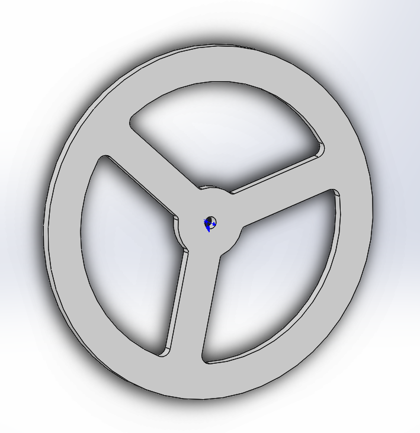
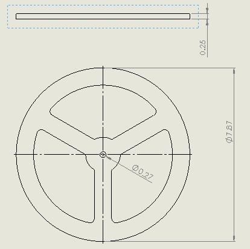
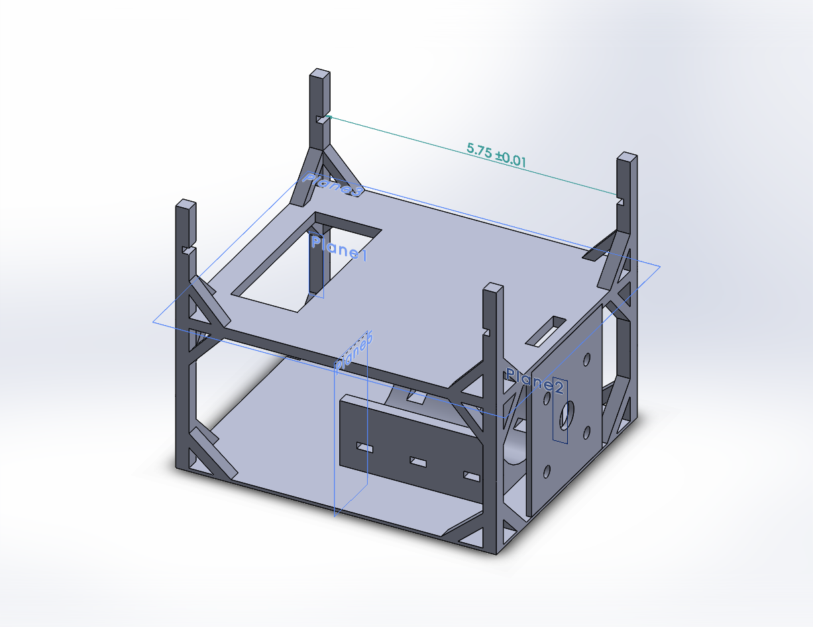
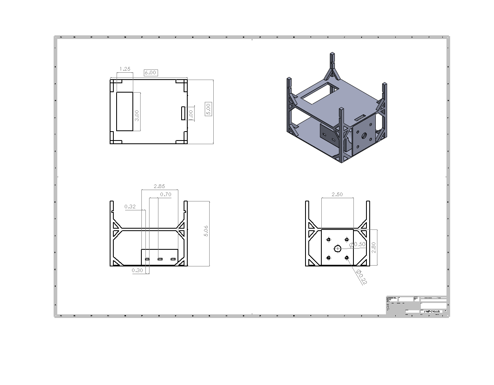

# Mechanical Design
## Reaction Wheel
The reaction wheel is the physical wheel turned to correct the angle of the robot.To maximize the moment of inertia while minimizing the mass, we chose a shape as close to a hoop as possible. The wheel (~8 in diameter) was then water-jet cut out of a 12x12x1/4 in sheet of aluminum, and the hole in the middle was tapped to screw onto the motor (M8 x 1.25mm pitch). The CAD model and drawing is shown below. 

  
   

## Robot Body

The main body of the robot was designed in SolidWorks then 3-D printed. The main features of the body are a pocket for the motor to fit into, holes for the encoder to fasten to, and shelves for the breadboard and E155 development board (FPGA+MCU). This design was meant to keep the body highly adjustable, so tweaks to electronics could be made after the print. The CAD model and drawing is shown below. 

  
   

